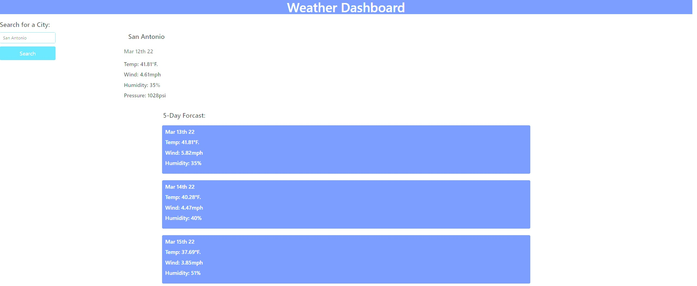

# Do-I-Need-An-Umbrella

## Desription: 
Planning a trip? Spending the weekend outside? Whatever it is if you're going to head outside be sure to checkout the Weather Dashboard! It's simple! Just enter your city name and you'll get current conditions and a 5 day forecast. 

## Technical Note
I was using BULMA instead of Bootstrap for the style of the sheet, I like the way it turned out and I had to write ZERO CSS. I did have some difficulties getting the weather images to show, they're there when you first enter the city but disappear as soon as you search for one. Also the local storage is working and it will save your previous city in the text area, I tried to add buttons using JS but they were not appearing. I did use TWO apis for current weather and 5 day forecast. The other api was only able to search using longitude and latitude and the README said "CITY" so I feel I took a more difficult route to achieve the same goal. ALSO! Clicking on GitHub Pages at the bottom of the README will take you to the deployed application. 

** NEITHER of the API's that I used had a UV Index. I went through line by line and there was none so I subbed "pressure" instead. 

This site was made using [GitHub Pages](https://ejimenez22.github.io/Do-I-Need-An-Umbrella/)

